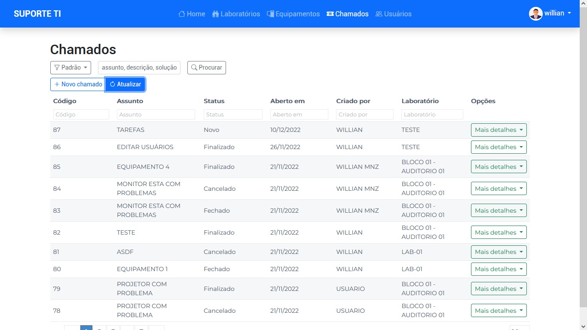
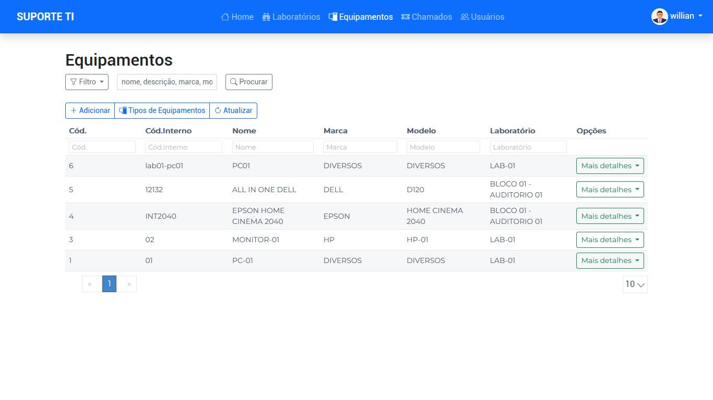

# Sistema de Chamados

Este projeto foi desenvolvido como Trabalho de Conclusão de Curso (TCC) do curso de **Sistemas de Informação** da **ESUCRI**, apresentado em Criciúma-SC, em 21/11/2022.

## 📌 Descrição

O **Sistema de Chamados** tem como objetivo registrar e gerenciar solicitações de chamados para manutenção de equipamentos de TI em uma instituição de ensino superior. Ele facilita a comunicação entre os solicitantes e a equipe técnica, otimizando o processo de suporte e manutenção.

## 🚀 Tecnologias Utilizadas

- **Frontend:** Angular, Bootstrap  
- **Backend (não incluído neste repositório):** C# .NET 6, ASP.NET, ASP.NET Identity
- **Banco de Dados:** PostgreSQL  
- **Ferramentas:** VSCode, Visual Studio

## 📷 Imagens do Sistema

## 👨‍💻 Autores

<table>
  <tr>
    <td align="center">
      <a href="https://github.com/WillianMz">
         
        <b>Willian</b>
      </a>
    </td>
    <td align="center">
      <a href="https://github.com/LukAzvdo">
         
        <b>Luciano de Azevedo</b>
      </a>
    </td>
    <td align="center">
      <a href="https://github.com/tiagogdorneles">
         
        <b>Tiago Dorneles</b>
      </a>
    </td>
  </tr>
</table>

## 👨‍💻 Orientador
- [Anderson Luís Furlan](https://github.com/andersonlfurlan)

## 📄 Licença

Este projeto está licenciado sob a licença [MIT](LICENSE).
